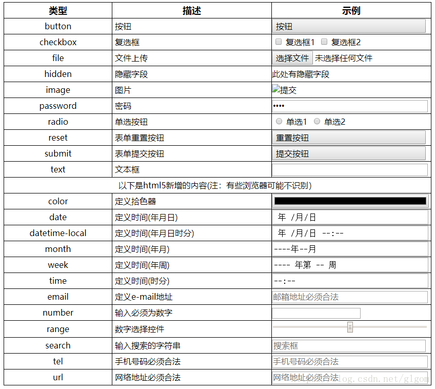

#前端笔记
##HTML总结

- **块元素：**
address – 地址   
blockquote – 块引用    
center – 举中对齐块     
dir – 目录列表   
div – 常用块级容易，也是CSS layout的主要标签   
dl – 定义列表   
fieldset – form控制组   
form – 交互表单   
h1 – 大标题   
h2 – 副标题   
h3 – 3级标题   
h4 – 4级标题   
h5 – 5级标题   
h6 – 6级标题   
hr – 水平分隔线   
menu – 菜单列表   
ol – 有序表单   
p – 段落   
pre – 格式化文本   
table – 表格   
ul – 无序列表   
li  
- **内联元素：**
a – 锚点   
abbr – 缩写   
acronym – 首字   
b – 粗体(不推荐)   
big – 大字体   
br – 换行   
cite – 引用   
code – 计算机代码(在引用源码的时候需要)   
dfn – 定义字段   
em – 强调   
font – 字体设定(不推荐)   
i – 斜体   
img – 图片   
input – 输入框   
kbd – 定义键盘文本   
label – 表格标签   
q – 短引用   
s – 中划线(不推荐)   
samp – 定义范例计算机代码   
select – 项目选择   
small – 小字体文本   
span – 常用内联容器，定义文本内区块   
strike – 中划线   
strong – 粗体强调   
sub – 下标   
sup – 上标   
textarea – 多行文本输入框   
tt – 电传文本   
u – 下划线  
- **input的几种类型**

- **form表单**  
``` html
<form action="form_action.asp" method="get">
  <p>First name: <input type="text" name="fname" /></p>
  <p>Last name: <input type="text" name="lname" /></p>
  <input type="submit" value="Submit" />
</form>
```
action:提交路径&nbsp;&nbsp;&nbsp;methods:提交方法（get/post）  
- get与post的区别：
1. get通过url传送数据，post通过报文传送
2. get传送的数据大小有限制，post无限制
3. GET产生一个TCP数据包；POST产生两个TCP数据包。
对于GET方式的请求，浏览器会把http header和data一并发送出去，服务器响应200（返回数据）；
而对于POST，浏览器先发送header，服务器响应100 continue，浏览器再发送data，服务器响应200 ok（返回数据）。

##css总结  
- **css选择器**
1. 元素选择器  
元素选择器（标签选择器），可以根据标签的名字来从页面中选取指定的元素。  
语法：  标签名 {}  
2. 类选择器  
类选择器，可以根据元素的class属性值选取元素。  
语法： .classname {}  
3. ID选择器  
ID选择器，可以根据元素的id属性值选取元素。注： id是唯一的。  
语法   # id { }  
4. 交集选择器  
可以同时使用多个选择器，这样可以选择同时满足多个选择器的元素。  
语法： 选择器1选择器2{}  
5. 并集选择器  
可以同时使用多个选择器，多个选择器将被同时应用指定的样式。用逗号隔开。  
语法： 选择器1,选择器2,选择器3 {}  
6. 后代选择器  
可以根据标签的关系，为处在元素内部的代元素设置样式。用空格隔开。  
语法： 祖先元素  后代元素  后代元素 { }  
7. 通用选择器  
可以同时选中页面中的所有元素。  
语法： * { }  
- **盒子模型**   
  
- **出现的问题**：  
1. 垂直叠加（重叠）  
问题的描述：   
有两个div,分别设置样式margin-bottom:100px;margin-top:200px;   
那么这两个div对应的竖直方向上的margin值是否会叠加？   
(1)不会，两个div之间的margin值会以大的为准，也就是说此时两个div之间的垂直间隔为200px。   
(2)如果两个div之间竖直方向上的margin值相同均为100px,那么它们之间的距离便是100px  
2. 嵌套情况（坍塌）  
当div发生嵌套 里面div的margin-top值 直接影响到了父类  
（现象：在一些浏览器中，有两个嵌套关系的div，如果外层div的父元素padding值为0，那么内层div的margin-top或者margin-bottom的值会“转移”给外层div）  
原因：盒子没有获得 haslayout 造成 margin-top 无效  
解决方法：  
1.overflow:hidden  
2.padding-top(父元素加paddiong减height)  
3.float  
  
- **display**  
我们不能为行内元素设置width、height、margin-top和margin-bottom。  
我们可以通过修改display来修改元素的性质。  
值：  
– block：设置元素为块元素  
– inline：设置元素为行内元素  
– inline-block：设置元素为行内块元素  
– none：隐藏元素  
- **visibility**  
visibility属性主要用于元素是否可见。  
和display不同，使用visibility隐藏一个元素，隐藏后其在文档中所占的位置会依然保持，不会被其他元素覆盖。  
值：  
– visible：可见的  
– hidden：隐藏的  
- **overflow**  
当相关标签里面的内容超出了样式的宽度和高度时如何处理  
可选值：  
– visible：默认值  
– scroll：添加滚动条  
– auto：根据需要添加滚动条  
– hidden：隐藏超出盒子的内容  
- **规避脱标流**  
1.能用标准流（没有脱标）解决就不用浮动  
2.解决不了就考虑有浮动（页面布局类型，“不完全脱标”）  
3.浮动解决不了用定位（小图标，完全脱标，不影响内容）  